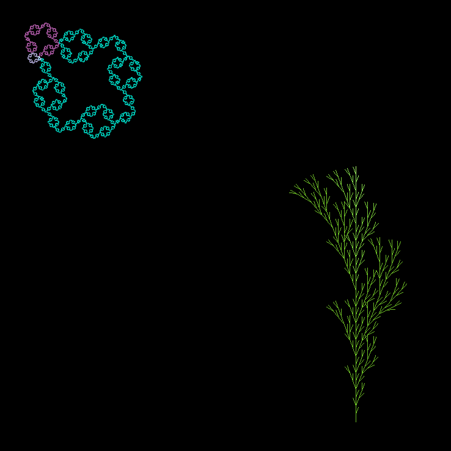

three-lsystem
=============

### Overview

`three-lsystem` is a basic implementation of
[L-systems](https://en.wikipedia.org/wiki/L-system) in [three.js](https://threejs.org/).



Currently, it supports the creation of:

- Deterministic context-free L-systems ("D0L systems")
- Stochastic L-systems
- Context-sensitive L-systems

The algorithms and examples have all been adapted from [Algorithmic Beauty of Plants
(Prusinkiewicz & Lindenmayer](http://algorithmicbotany.org/papers/abop/abop.pdf).

At present, the library is mostly just for experimentation and is not likely to be very
useful in any realtime applications.

Long-term, the hope is it continue working on this, and to gradually move towards more
natural-looking plants, both in terms of the underlying patterns of growth and
morphology, as well as outward appearance.

### Usage

To get started, the easiest this is to clone this repo, install the necessary
dependencies using [yarn](https://yarnpkg.com/), and run the included demo:

```
git clone https://github.com/khughitt/three-lsystems
cd three-lsystems
yarn install
yarn start
```

### How it works

`three-lsystem` implements a `Lsystem` class that inherits from `THREE.Group`.
This allows for complex objects to be generated and interacted with as just like normal
three.js objects, e.g.:

```
const lsys = new Lsystem();
scene.add(lsys);
```

When a new `Lsystem` instance is created, the specified parameters and productions are
used to generate the final L-system, and a `Turtle` class is used to compose the
resulting structure.

The `Turtle` class itself uses one of two _renderers_ (2d/3d) to determine what should
be drawn to the screen.

### Development & Feedback

There are likely many ways this library can be improved, both in terms of the underlying
L-system implementation, how its rendered and interfaces with three.js, and performance
and deployment.

I hope to gradually work on this over time, and hope to improve it as I become more
versed in all of the relevant skills it builds on.

Suggestions and contributions are welcome. I can't promise that I will be quick to
implement any suggestions, but I will try and keep track of them and work on things as I
have time.
